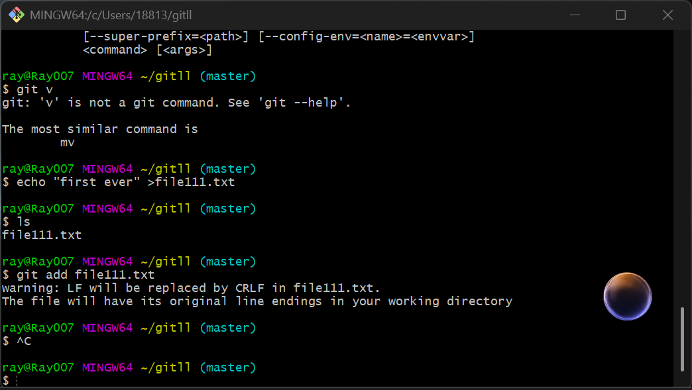
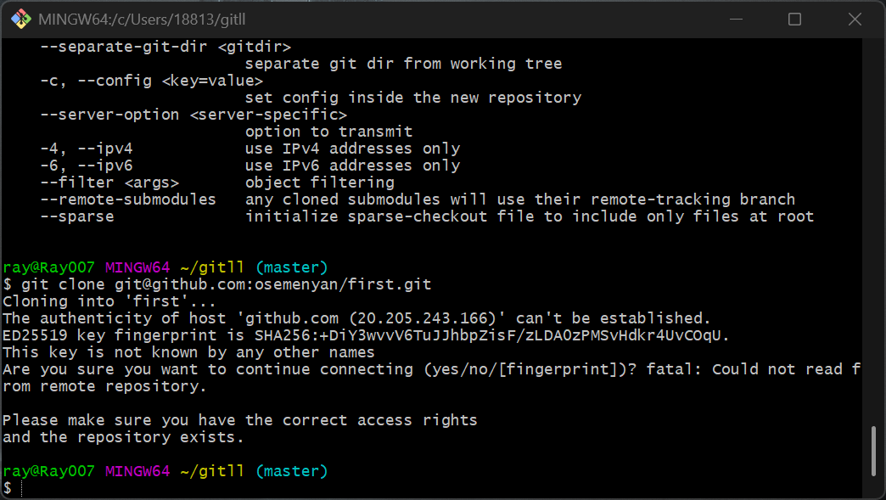
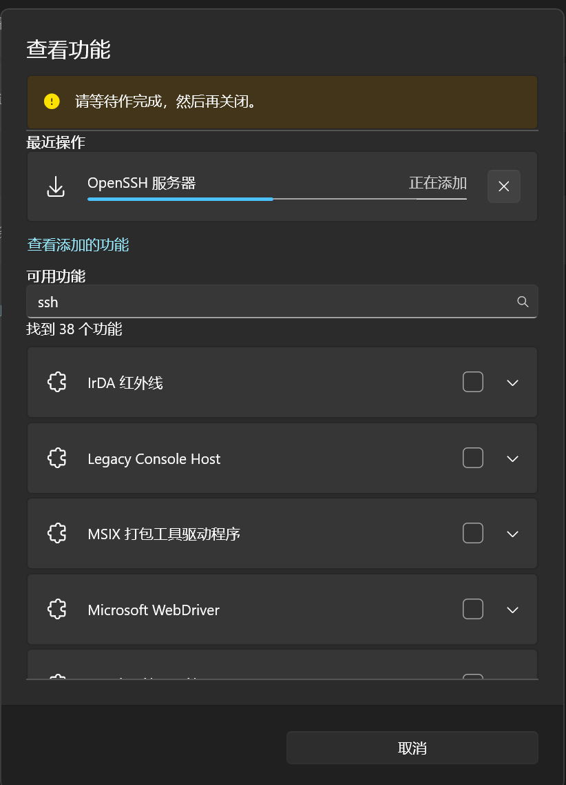

# git学习
## git安装
- 官网下载的没啥问题
# 仓库使用
- 第一次推送至暂存库就出现问题

google了一下发现好像是因为不同换行导致知乎上说“如果我们目前是Window平台并出现该警告，啥也别做就行，虽然这个警告难看，但这个警告能保证我们项目团队正常跨系统git操作代码”**那看起来没什么需要做的**问题看起来解决了

## git commit
- 只能提交暂存区的文件（用通配符*添加多个）
- 一定要加-m否则进vim搞不懂
## git log
- 查看历史
## git reset
回退
# 远程仓库
克隆仓库出现问题

google 发现是系统无法验证 GitHub 主机的真实性
- 好像不用管只用输y就行了
## 发现需要配置ssh

