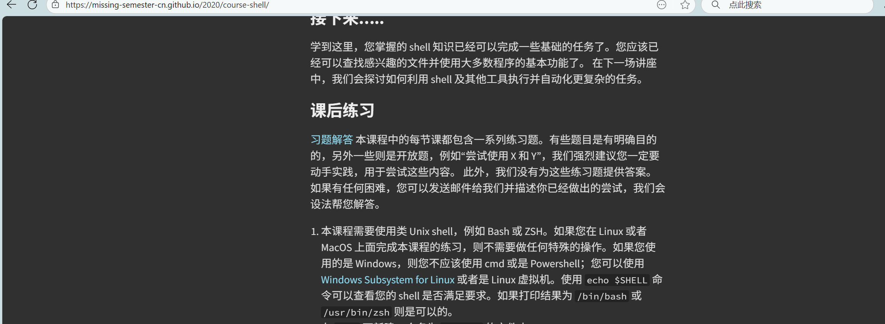
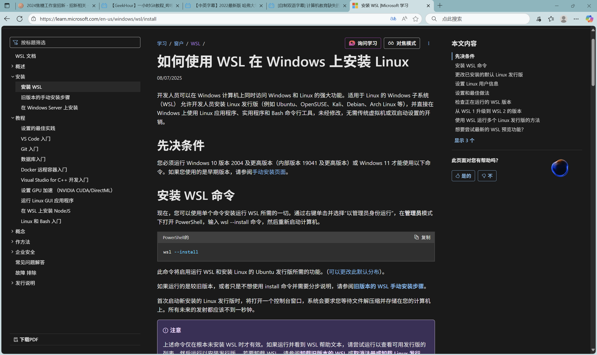
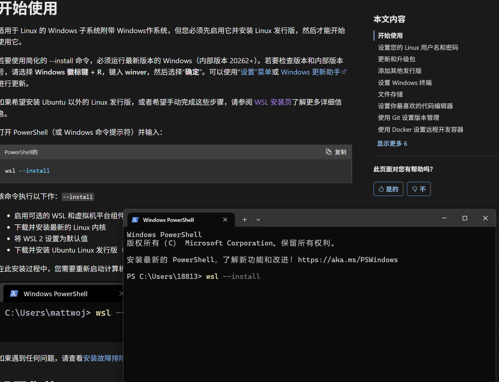
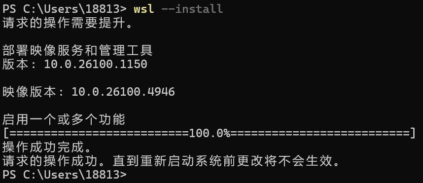
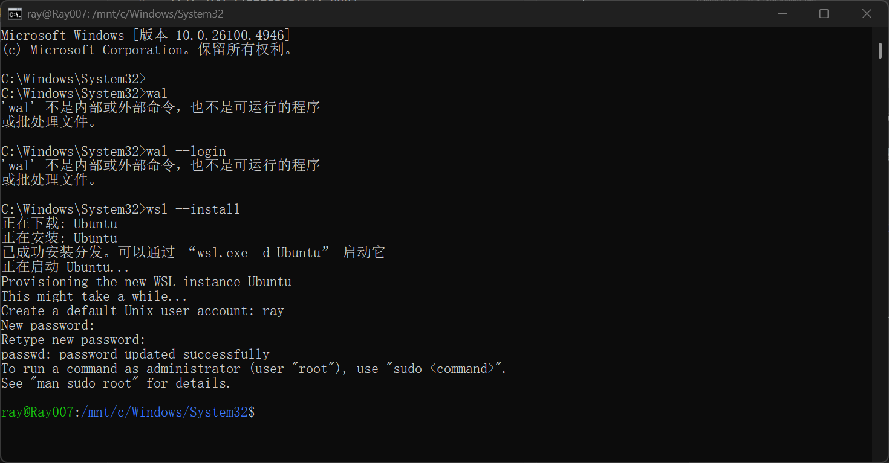
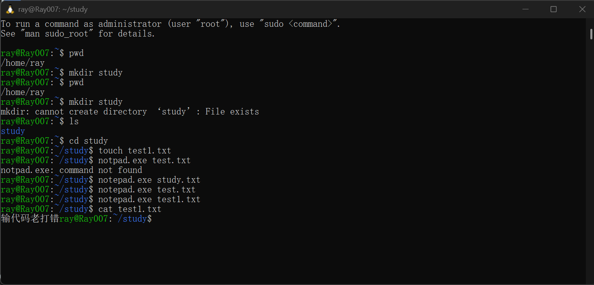

# 9.4 wls的第一天

- 在神奇的计算机课程的缺失一课找到了wls链接（纯意外）

- 在官网中一步步跟教程走

- 然后重启

- 似乎成功的安装

- 尝试简单指令

## 感受
- microsoft教程做的不错挺方便，远胜神人vscode配置，**中间在安装中因要上课中断回来忘了要以管理员身份启动，害的我找半天哪里出问题了。**-**待会我可能要尝试搞git,github账号已经注册了看看咋样。
- 装了也不知道能干什么，“先跟着神奇的计算机课程的缺失一课”看看吧
